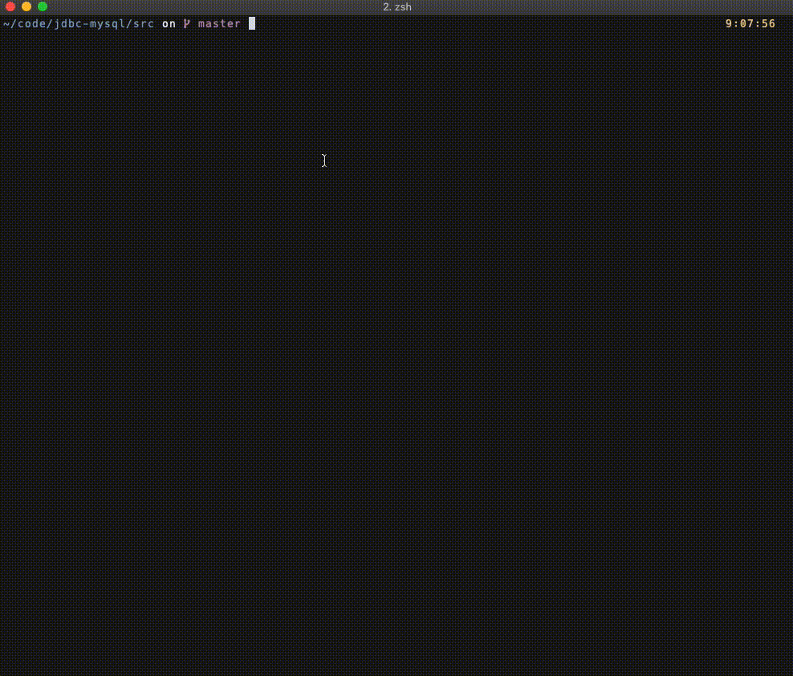

# TDT4145 Databases and Database Management Systems

> Database project

## Setup

```sh
$ docker-compose up -d
```

## Getting started

- Access the docker container where the MySQL database is running.

```sh
# Get container id, and attatch STDOUT and STDIN to this container
$ docker ps
$ docker exec -it [id] sh

```

- Access the MySQL database running

```sh
# Enter the running MySQL server
$ mysql -u root -p
```

## Running java source code

> This project utilize the `JDBC api` to connect to the MySQL database

The connector can be download [here](https://dev.mysql.com/downloads/connector/j/8.0.html). After downloading the `.jar` you'll need to add it to your `CLASSPATH`.

```sh
# Note the `YOUR_PATH` section, as you can put this wherever you want.
export CLASSPATH=.:$CLASSPATH:~/[YOUR_PATH]/mysql-connector-java-8.0.15.jar

# Then compile and the `JDBC.java` file
$ cd src/
$ javac JDBC.java && java JDBC

```


## Shut down project

```sh
# Turn off container
$ docker-compose kill

# Remove container
$ docker-compose down
```

## Gif

> Preview


